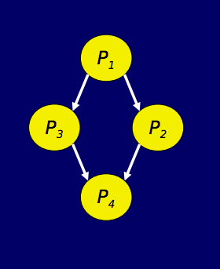

# <div style='text-align:center;'>Concetti Base</div>
## Fork e Join
#### fde_id = fork: crea un flusso di esecuzione figlio di quello attuale e restituisce l'identificatore del f.d.e figlio appena creato. I flussi di esecuzione di padre e figlio continuano indipendenti tra di loro.
#### join fde_id: il flusso di esecuzione corrente rimane bloccato fino a che non termina il flusso di esecuzione con l'identificatore specificato.
#### La fork crea quindi un flusso figlio rispetto al corrente, mentre la join blocca tutti i processi attivi e li fa attendere affinché l'id del flusso di esecuzione passato alla join non termina. Ciascun flusso è dotato di proprie aree di memoria, mentre il codice può essere condiviso.
### Esempio di traduzione di un diagramma delle precedenze con fork e join:
<div style='text-align:center;'></div><br>
```
concurrent procedure P1
begin 'corpo di P1'; end 
concurrent procedure P2
begin 'corpo di P2'; end
...
begin
	var p2_id, p3_id : f.d.e_id;
	P1();
	p2_id = fork P2; p3_id = fork P3;
	join p2_id; join p3_id;
	P4();
end
```
#### Vantaggi:
* Flessibilità
* Espressività

#### Svantaggi:
* basso livello di astrazione
* il programmatore è costretto a specificare la creazione di flussi
* non impongono struttura al programma concorrente

#### cobegin P1||P2||... coend, permettono di eseguire n istruzione concorrentemente.

## Condizioni di Bernstein
#### Quando è lecito eseguire concorrentemente due istruzioni Ia ed Ib?
#### Se valgono le seguenti condizioni:
* range(Ia) 	&#8745; range(Ib) = &#8709;
* range(Ia) 	&#8745; domain(Ib) = &#8709;
* domain(Ia) 	&#8745; range(Ib) = &#8709;

#### Se indichiamo con A,B,...,Z un'area di memoria, e sia i un'istruzione, essa dipende da una o più aree di memoria che denotiamo con domain(i), ed altera il contenuto di una o più aree di memoria che denotiamo range(i).
#### Nella condizione di Bernstein non si impone alcuna condizione su domain(Ia) 	&#8745; domain(Ib) = &#8709; 

# Interferenza
#### Si ha interferenza in presenza di:
* due o più flussi di esecuzione
* almeno un flusso di esecuzione scrivente

#### Un esempio di interferenza può essere la prenotazione in contemporanea di due utenti dell'ultimo posto di un volo.

#### Questo avviene, perché:
* un flusso esegue un cambio di stato dell'area di memoria in maniera non atomica.
* gli stati transienti che intercorrono tra quello iniziale e finale sono visibili a flussi di esecuzione diversi da quello che li sta producendo
* le piattaforme di riferimento non offrono la possibilità di fare aggiornamenti atomici

# errori dipendenti dal tempo
#### L'interferenza causa errori temibili, perché dipendenti dalla sequenza di interleaving eseguita, dove ciascuna sequenza di esecuzione può produrre effetti diversi, e la scelta della particolare sequenza adottata è casuale e non dipende dal programmatore.
#### Caratteristiche degli Errori dipendenti dal tempo:
* irriproducibili: possono verificarsi con alcune sequenze e non con altre
* indeterminati: esito ed effetti dipendono dalla sequenza
* latenti: possono presentarsi solo con sequenze rare
* difficili da verificare e testare: perché le tecniche di verifica e testing si basano sulla riproducibilità del comportamento.

#### Il programmatore non può fare alcuna assunzione:
* sulla particolare sequenza di interleaving eseguita
* sulle velocità relative dei vari processori virtuali
* su un qualsiasi altro tipo di sincronismo legato all'implementazione dei processori virtuali
* sulla indivisibilità delle istruzioni

#### L'unica assunzione che si può fare è che tutti i processori virtuali hanno una velocità finita non nulla. 

# Starvation & deadlock
#### Esistono due diverse situazioni che possono invalidare l'assunzione di progresso finito (tutti i processori virtuali hanno una velocità finita e non nulla):
* Starvation: quando un f.d.e. rimane in attesa di un evento che si verifica infinite volte (un sistema di f.d.e. che garantisce contro questa evenienza si dice che goda della proprietà di fairness)
* Deadlock (o stallo): quando due o più f.d.e. rimangono in attesa di eventi che non potranno mai verficarsi a causa di condizioni cicliche nei f.d.e. e nella richiesta di risorse. (es: un processo Pa, possiede una risorsa R1 e richiede una risorsa R2 già posseduta da un altro processo Pb, quest'ultimo a sua volta richiede l'uso di R1).

#### Proprietà di fairness: 
* Accezione stringente, non bastano argomentazioni probabilistiche: se esiste anche una sola sequenza di esecuzione ammissibile in cui un flusso non avanza mai, un algoritmo è considerato unfair
* Chiamiamo unfair anche una simile sequenza

#### Osservazioni: se un algoritmo è unfair, ma dal punto probabilistico sembra produrre soltanto sequenze unfair con probabilità tendenti allo zero, potrebbe causare:
* Starvation: le sequenze unfair, diventa probabile a causa di fattori trascurati nella modellazione
* Forte varianza nei tempi d'attesa di un f.d.e.

#### Conseguenze dell'unfairness:
* Forte impatto nelle performance
* Varianza dei tempi di esecuzione
* Il contesto detta la scelta più opportuna

# Divisibilità delle istruzioni 
#### Assumiamo che tutte le istruzioni di cui faremo uso siano divisibili, anche le più elementari, poiché ipotesi diverse richiederebbero una conoscenza più approfondita del linguaggio utilizzato.

# Strategie per la gestione dell'interferenza
#### Due flussi di esecuzione possono essere:
* Disgiunti
* Interagenti

#### Competizione: due o più flussi di esecuzione che richiedono l'uso di una risorsa comune. <br> Cooperazione: due o più flussi di esecuzione cooperano per raggiungere un obiettivo comune

#### La competizione occorre ogni qualvolta è presente una risorsa riusabile condivisa e di molteplicità finita, spesso seriale (es: incrocio stradale, sportellista alle poste, rete ethernet, ...)

#### In presenza di competizione è necessario gestire i possibili fenomeni di interferenza.

#### La strategia migliore per gestire l'interferenza dipende fortemente dal contesto, almeno da questi elementi:
* La natura delle conseguenze 
* La possibilità di recuperarla
* La possibilità di rilevare l'interferenza
* Il livello di competizione

#### Le strategie si classificano in:
* Ottimistiche/Progressiste/try-and-see
* Pessimistiche/Conservatrici/check-and-act

# Tecniche per la gestione dell'interferenza
#### Le strategie trovano concretezza in alcune tecniche di programmazione per la scrittura di codice privo di interferenza (immutabilità delle aree di memoria, confinamento degli aggiornamenti, esclusione delle sequenze di interleaving).

# Architettura di riferimento
#### Architetture più diffuse:
* SMP
* Cluster di elaboratori
* Data-flow per il calcolo vettoriale


