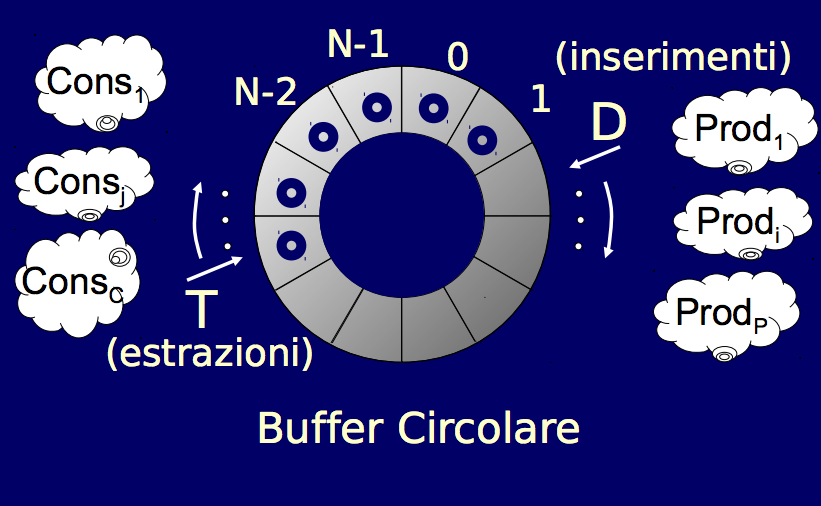

# Problemi classici

## Introduzione ai problemi classici
#### I problemi classici sono rilevanti per i seguenti motivi:
* permettono di illustrare alcuni problemi della programmazione concorrente come lo stallo e la starvation
* costituiscono una base di confronto per valutare l'espressività e l'eleganza di eventuali nuovi linguaggi/costrutti
* taluni hanno chiarissime applicazioni pratiche
* soluzioni consolidate si possono riutilizzare adattandole a problemi simili.

## I cinque filosofi mangiatori
#### È un problema classico, cinque filosofi trascorrono la vita alternando ciascuno indipendentemente dagli altri, periodi in cui pensano e periodi in cui mangiano.

#### Per mangiare ogni filosofo necessita di due forchette poste a sinistra e a destra del proprio piatto.
#### Si prevede che ogni filosofo segua un certo protocollo, ovvero pensa, si impossessa delle forchette, mangia e rilascia le due forchette, le forchette saranno modellate con una variabile condivisa.
#### Una situazione di stallo che si può facilmente presentare è che tutti i filosofi possiedono una sola forchetta, quindi ognuno possiede una forchetta e nessuno riesce a mangiare.
#### Un approccio ottimistico: Se un filosofo trova la seconda forchetta occupata, allora rilascia anche la prima, ed attende prima di riprovare, questo approccio non gode della proprietà di fairness.
#### Un approccio conservativo: Per evitare lo stallo senza compromettere il parallelismo, rendiamo indivisibile l'operazione di acquisizione delle risorse. var F: shared array[0..4] of semaforo, rappresenta la coppia di forchette, mentre var FP: shared array[0..4] of boolean, FP[i] è vero solo se l'i-esima coppia di forchette è prenotata, var A: shared array[0..4] of booelan, A[i] è vero solo se l'i-esimo filosofo è affamato, var R: Semaforo, un semaforo binario, per accedere allo stato corrente in mutua esclusione.

```
concurrent program CINQUE_FILOSOFI_MANGIATORI;
type filosofo = concurrent procedure(I:0..4);
begin loop
	<<pensa>>
	prendi_forchette(i);
	<<mangia>>
	posa_forchette(i);
end
var A,B,C,D,E: filosofo;
	J: 0..4
var R:semaforo;
var F: shared array[0..4] of semaforo;
var FP: shared array[0..4] of boolean;
var A: shared array[0..4] of boolean;
begin
	INIZ_SEM(R,1)
	for J <- 0 to 4 do INIZ_SEM(F[J],0);
	for I <- 0 to 4 do FP[i] <- false;
	for K <- 0 to 4 do A[K] <- false;
	cobegin A(0)||B(1)||C(2)||D(3)||E(4) coend
end
```
#### DI seguito le procedure prendi_forchette e posa_forchette:
```
concurrent procedure prendi_forchette(I:0..4)
begin
	P(R);
	A[I] <- true;
	test(I);
	V(R);
	P(F[I]);
end

concurrent procedure test(I:0..4)
begin
	if(A[I] and not FP[(I-1)mod5] and not FP[(I+1)mod5])
		begin 
			FP[I] <- true;
			V(F[I]);
		end
end

concurrent procedure posa_forchette(I:0..4)
begin 
	P(R);
	FP[I] <- false;
	A[I] <- false;
	test((I-1)mod5); 
	test((I+1)mod5);
	V(R); 
```
#### Questa soluzione non presenta stallo ed offre il maggior grado di parallelismo possibile.

### La proprietà di fairness di un algoritmo
#### Accezione stringente: se esiste anche una sola possibile sequenza di esecuzione ammissibile in cui un flusso non avanza mai, allora tale algoritmo è unfair.

#### Conseguenze dell'unfairness:
* Starvation
* Forte varianza nei tempi di attesa di un f.d.e.

#### Nella pratica spesso soluzioni unfair sono anche preferite, poiché più efficienti in termini di troughput.
#### La programmazione concorrente costringe a compromessi tra:
* grado di parallelismo
* pericolo di stallo, starvation ed interferenze
* semplicità 
* riusabilità

## Il barbiere dormiente
#### In un negozio lavora un solo barbiere, ci sono N sedie per accogliere i clienti in attesa ed una sedia di lavoro. Se non ci sono clienti, il barbiere si addormenta sulla sedia di lavoro. Quando arriva un cliente questo deve svegliare il barbiere, se addormentato od accomodarsi su una delle sedie in attesa che finisca il taglio corrente. Se nessuna sedia è disponibile preferisce non aspettare e lascia il negozio.
#### Soluzione:
```
concurrent procedure BARBIERE_DORMIENTE;
type barbiere = concurrent procedure; 
begin loop
	P(C); //attendi clienti
	P(MX); 
	in_attesa <- in_attesa-1;
	V(B); //segnala la disponibilità
	V(MX); //del barbiere
	<<taglia_capelli>>;
end
type cliente = concurrent procedure;
begin 
	<<raggiungi_negozio>>;
	P(MX);
	if(in_attesa < N)
		in_attesa <- in_attesa+1
		V(C); //Sveglia il barbiere se dorme
		V(MX);
		P(B); //Aspetta che il barbiere finisca
		<<siedi_per_taglio>>;
	end
	else V(MX); //neanche un posto a sedere, meglio ripassare
end
var Dormiente: Barbiere
var CLIENTE array[0..NUM_CLIENTI] of cliente
var C, MX, B: semaforo;
var N = 5;
var in_attesa: intero;
begin 
	INIZ_SEM(MX,1); INIZ_SEM(C,0); INIZ_SEM(B,0);
	fork Dormiente;
	for j <- 0 to NUM_CLIENTI do fork CLIENTE[j];
	for j <- 0 to NUM_CLIENTI do join CLIENTE[j];
	join Dormiente;
end
```
#### Due f.d.e. possono essere: 
* disgiunti
* interagenti

## Produttori/Consumatori
#### Un f.d.e. P (produttore) deve continuamente inviare messaggi ad un altro f.d.e. C (consumatore) che li elabora nello stesso ordine in cui li ha ricevuti, per fare ciò viene utilizzato un buffer di scambio, dove P scrive i messaggi e C li legge.
#### Bisogna sincronizzarsi su due eventi a cui associamo due semafori binari, DEPOSITATO che sta ad 1 solo se un messaggio è stato depositato ed è prelevabile, e PRELEVATO che sta ad 1 solo se il buffer è vuoto e pronto ad accogliere un nuovo messaggio.

```
concurrent program COOPERAZIONE;
type messaggio = '...';
var M: messaggio;
var DEPOSITATO, PRELEVATO: semaforo_binario;
begin 
	INIZ_SEM(PRELEVATO,1); INIZ_SEM(DEPOSITATO, 0);
	cobegin PROD||CONS coend

concurrent procedure PROD
begin loop
	<produci un messaggio in M>
	P(PRELEVATO);
	BUFFER <- M; 
	V(DEPOSITATO);
end

concurrent procedure CONS
begin loop
	P(DEPOSITATO);
	M <- BUFFER;
	V(PRELEVATO);
	<consuma il messaggio M>
end
```
#### La soluzione comporta la perfetta alternanza produttore-consumatore, l'unica sequenza di esecuzione ammissibile è produci-consuma-produci-...
#### Nel caso in cui abbiamo più f.d.e. sono necessarie sincronizzazioni analoghe a quelle viste per un singolo f.d.e. ed inoltre bisogna evitare che:
* un produttore scriva su un buffer già pieno
* un consumatore legga da un buffer vuoto

#### Il buffer può essere visto come una risorsa di molteplicità finita per il quale competono sia i produttori che i consumatori, semafori a conteggio vengono inizializzati come la dimensione del buffer, solitamente viene rappresentato a buffer circolare:
