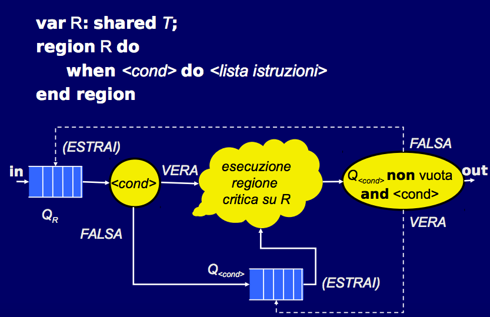

# Regioni critiche

## Limite dei semafori
#### Dalle caratteristiche dei semafori:
* primitivi 
* potenti
* flessibili

#### Risultano espressivi (permettono di risolvere qualsiasi problema di sincronizzazione), ma non sono strutturati, difficili da testare, richiedono l'utilizzo di variabili comuni, e quindi nasce l'esigenza di strumenti a più alto livello di astrazione. 

## Le regioni critiche
#### Sono più ad alto livello rispetto ai semafori, non hanno una controparte tra i linguaggi di programmazione comuni, tuttavia:
* Rappresentano un passo intermedio prima dei monitor, che sono il meccanismo alla base dei costrutti di sincronizzazione nei linguaggi moderni
* Consentono di motivare più facilmente le scelte progettuali alla base della semantica dei monitor.

#### Sintassi base: Sia R una variabile, var R: shared T; ed associata ad una risorsa seriale R di tipo T, allora il costrutto di regione critica assume una forma del tipo:
```
region R do
	<lista_istruzioni> //sezione critica con uso di R
end region
```
#### Ovviamente la semantica è quella di garantire l'indivisibilità della sezione critica. L'implementazione prevede:
* Un semaforo binario Sr associato alla variabile condivisa R
* P(Sr) prima di ogni sezione critica su R
* V(Sr) dopo ogni sezione critica su R

## Le regioni critiche condizionali
#### Il f.d.e. appena entrato in regione critica valuta una condizione (che coinvolge la variabile condivisa), se è vera si eseguono le istruzione, se falsa, si esce dalla sezione critica (rimane in attesa passiva in una coda Qcond associata alla condizione specificata, uscendo dalla sezione critica si da modo ad altri f.d.e. di agire  in sezione critica sulla variabile condivisa, cambiare lo stato della risorsa, ...).
#### La condizione è rivalutata dopo l'esecuzione di ogni regione critica sulla stessa variabile e se soddisfatta viene risvegliato il primo f.d.e. in attesa dentro la coda Qcond.

#### Possono esistere diverse condizioni per ciascuna regione critica, bisogna scegliere quale f.d.e. far entrare in sezione critica tra:
* tutti quelli che si trovano in cima alle code Qcond, per le quali la condizione <cond> risulta vera
* i nuovi flussi in entrata in Qr

#### Semantica adottata: scelta non deterministica
#### Può essere usata per la risoluzione di un problema classico, i cinque filosofi mangiatori:
```
concurrent_program CINQUE_FILOSOFI_MANGIATORI
type filosofo = concurrent procedure (I:0..4);
	begin ... end
var A,B,C,D,E: filosofo;
	J:0..4
	var LIBERA: shared array[0..4] of boolean;
begin 
	for J<-0 to 4 do LIBERA[J]<-true;
	cobegin A(0)||B(1)||C(2)||D(3)||E(4) coend
end
```
#### a questo punto l'implementazione di filosofo sarà:
```
begin loop 
	<<pensa>>;
	region LIBERA
		when LIBERA[I] and LIBERA[(I+1)mod5] do
			LIBERA[I]<-false;
			LIBERA[(I+1)mod5]<-false;
	end region;
	<mangia>;
	region LIBERA
		LIBERA[I]<-true;
		LIBERA[(I+1)mod5]<-true;
	end region;
end;
```
#### Lo stallo viene evitato imponendo l'acquisizione contemporanea di due forchette, quando un filosofo scopre che almeno una delle due forchette è occupata abbandona la regione critica condizionale ed aspetta nella coda. La soluzione proposta non gode della proprietà di fairness.
#### Le regioni critiche hanno due principali limitazioni:
* efficienza: per la necessità di rivalutare le condizioni all'uscita di ogni regione critica
* coesione: le regioni critiche sulla stessa variabile condivisa possono essere sparse su tutto il programma.

## I limiti delle regioni critiche

## Oltre le regioni critiche