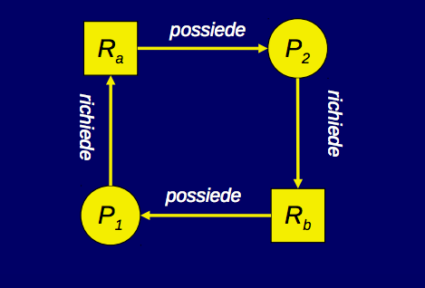

# Stallo
#### Affinché si manifesti uno stallo, devono verificarsi tutte le seguenti condizioni (condizioni di Coffman):
* Condizione di mutua-esclusione: le risorse condivise sono seriali
* Condizione di incrementalità delle richieste: i processi richiedono le risorse una alla volta
* Condizione di non-prerilasciabilità: le risorse non sono prerilasciabili
* Condizione di attesa circolare

#### Un esempio di attesa circolare tra due f.d.e. e due risorse (grafo di allocazione):

## Tecniche di gestione dello stallo
* Fuga dallo stallo: ovvero, si rifiutano le richieste di risorse che causano o potrebbero causare lo stallo.
* Riconoscimento e risoluzione dello stallo: si analizza il grafo di allocazione per riconoscere eventuali stalli in atto (tecniche di risoluzione).
* Prevenzione dello stallo: si cerca di prevenire lo stallo invalidando una delle condizioni di Coffman

### Fuga dallo stallo
#### Strategia conservativa: si ammette la possibilità di rifiutare o posticipare alcune richieste.
#### Consiste nel mantenersi uno stato sicuro nell'allocazione delle risorse, lo stato è sicuro se: 
* non si è in stallo
* si è in grado di soddisfarre in un tempo finito tutte le richieste non ancora evase

#### Un algoritmo di fuga dallo stallo è l'Algoritmo del Banchiere, un Banchiere (gestore della risorsa), concede prestiti (risorse) ai propri clienti (f.d.e.), le regole osservate dal banchiere sono le seguenti:
* ogni cliente dichiara in anticipo il proprio fido
* la cassa iniziale della banca è capace di coprire il massimo fido
* i clienti si impegnano a restituire il prestito in un tempo finito, ma possono aver bisogno di ragigungere il tetto del fido prima di cominciare a farlo
* il banchiere può temporanemanete rifiutare un prestito se ritiene che in seguito alla concessione potrebbe non riuscire a garantire in un tempo finito il fido di tutti i clienti.

#### I problemi principali della tecnica basata sulla fuga dallo stallo è che si tratta di un approccio cooperativo e conservativo, cooperativo ovvero che i processi devono specificare in anticipo il numero di risorse che intendono consumare e conservativo, ovvero che pur di non correre il pericolo di stallo, vengono rifiutate richieste, che non necessariamente conducono allo stallo.

### Riconoscimento e Risoluzione dello stallo
#### Strategia ottimistica: non si prendono precauzioni contro lo stallo. Si rilveano le situazioni di stallo che possono verificarsi (un esempio è cercare cicli nel grafo di allocazione), e quindi risoluzione dello stallo (ad esempio eliminando uno dei f.d.e. coinvolti).

### Prevenzione dello stallo 
#### Si invalidano una delle condizioni di Coffman, per la prima non possiamo fare nulla poiché la serialità è una caratteristica intrinseca della risorsa. Per invalidare l'incrementalità delle richieste, abbiamo che le risorse vengono richieste atomicamente, ovvero o si ottengono tutte o nessuna, questo comporta due svantaggi, cooperazione dei f.d.e., una risorsa risulta inutilizzata. Invalidare la non prerilasciabilità, tutte le volte che un f.d.e. si vede rifiutare una richiesta di risorsa, deve rilasciare tutte quelle già ottenute e ricominciare, svantaggi: costi del prerilascio forzato, degrado complessivo, non applicabile a risorse non prerilasciabili. Per invalidare l'attesa circolare, si adotta uno schema di allocazione delle risorse che impedisce la creazione di cicli nel grafo di allocazione, lo svantaggio principale è la possibile sottoutilizzazione delle risorse. La stragia più conveniente dipende dal contesto di riferimento.

